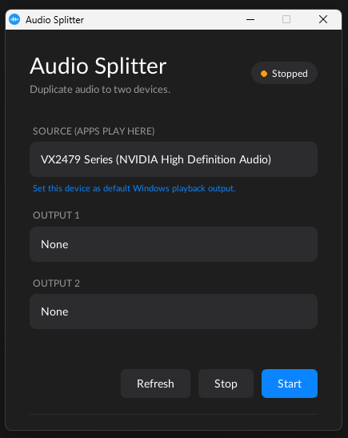

# Audio Splitter 🎧



Hey there! Welcome to Audio Splitter, a super lightweight, minimal C++ app that lets you route a single audio stream to two output devices at the same time. We designed it with a modern, premium UI (think slick mobile app design) right on your desktop!

## The Story Behind It 📖

The idea behind Audio Splitter came about when a friend and I were trying to watch a movie together on my PC. We both wanted to use our own headphones (one wired, one AirPods) so we wouldn't disturb anyone else. To our surprise, we discovered that Windows natively only allows you to output audio to a single device at a time! Thus, Audio Splitter was born to solve this exact problem—making it easy to share audio across multiple devices simultaneously.

## What makes it tick? ⚙️

The project is split into four neat pieces:

* **Platform (Window)**: Native platform window handling with an OpenGL 3.3 Core context.
* **UI (UIManager)**: Powered by HTML/CSS via **RmlUi**. We've heavily optimized this part—no debuggers, no extra samples, just a custom OpenGL backend to keep it fast and lightweight.
* **Audio (AudioManager)**: Uses `miniaudio` under the hood. It grabs the loopback audio from your source and streams it in real-time to two separate playback devices using safe, lock-free ring buffers.
* **App (Application)**: The main loop that ties everything together.

## Code Style 📝

If you're jumping into the code, you'll notice we follow the **Unreal Engine Coding Standard**.

That means:
- `PascalCase`
- `F` / `U` class prefixes
- `b` prefix for booleans
- Allman-style bracing

A `.clang-format` file is included to automatically format the code.

---

# Getting Started 🚀

The build system handles dependencies automatically and builds a minimal, optimized version of the required libraries.

## Prerequisites

### Windows

* **OS**: Windows 10 or 11
* **Toolchain**:
  - MSYS2 UCRT64
  - CMake
  - Ninja
  - GCC/G++

No external libraries need to be installed. CMake builds required dependencies automatically.

---

### Linux

Supported Linux environments:

- Fedora
- Ubuntu/Debian
- Arch Linux
- Other modern Linux distributions with CMake support

Required packages:

```bash
cmake
ninja
gcc
g++
OpenGL development packages
SDL3 development packages
````

Example (Fedora):

```bash
sudo dnf install cmake ninja-build gcc-c++ SDL3-devel SDL3_image-devel
```

Example (Ubuntu):

```bash
sudo apt install cmake ninja-build build-essential libsdl3-dev libsdl3-image-dev
```

---

# Building the Project 🔨

## Windows Build

The project statically links the C++ runtime and dependencies.

The final release binary is a single self-contained executable.

### Release Build

```bash
cmake -B build/release -G Ninja -DCMAKE_BUILD_TYPE=Release \
      -DCMAKE_C_COMPILER=C:/msys64/ucrt64/bin/gcc.exe \
      -DCMAKE_CXX_COMPILER=C:/msys64/ucrt64/bin/c++.exe

cmake --build build/release
```

### Debug Build

```bash
cmake -B build/debug -G Ninja -DCMAKE_BUILD_TYPE=Debug \
      -DCMAKE_C_COMPILER=C:/msys64/ucrt64/bin/gcc.exe \
      -DCMAKE_CXX_COMPILER=C:/msys64/ucrt64/bin/c++.exe

cmake --build build/debug
```

---

# Linux Build 🐧

Create a build directory:

```bash
mkdir build
cd build
```

Configure the project:

```bash
cmake -G Ninja -DCMAKE_BUILD_TYPE=Release ..
```

Build:

```bash
ninja
```

The executable will be generated inside the build directory.

Run:

```bash
./AudioSplitter
```

---

# Linux AppImage Distribution 📦

Audio Splitter can also be packaged as a portable **AppImage** so users can run it across different Linux distributions without installing dependencies.

To generate an AppImage:

```bash
./generate_AppImage.sh
```

This will:

* Build the AppImage bundle
* Package required runtime files
* Create a portable executable

Run the generated AppImage:

```bash
./AudioSplitter-x86_64.AppImage
```

The AppImage keeps the native performance of the application while providing easy distribution across Linux systems.

---

# Running the App ▶️

After building:

### Windows

Open:

```
build/release/
```

Run:

```
AudioSplitter.exe
```

The `Assets/` folder will already be copied beside the executable.

### Linux

Run:

```bash
./AudioSplitter
```

or use the generated AppImage.